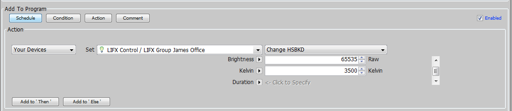

Usage
=====

Installation
~~~~~~~~~~~~

To run the current version you should pull the default branch. The `github page is here 
<https://github.com/Einstein42/lifx-nodeserver>`_.

.. code-block:: bash

    # Install the bitstring required package this is needed for talking to the LIFXLan protocols
	sudo pip install bitstring
	
    # If you run into an error about upgrading pip in the previous step then upgrade pip like so:
	sudo pip install --upgrade pip
	
    # Go to your Polyglot/config/node_servers/ folder
	git clone https://github.com/Einstein42/lifx-nodeserver.git
	
    # Restart Polyglot to recognize the new Node Server type.
	sudo systemctl restart polyglot

Now that Polyglot is restarted. Login to your Polyglot admin page::

    http://<ip address>:8080

Add Node Server
~~~~~~~~~~~~~~~

Click on Add Node Server once you login to your Polyglot admin interface. Select the
LIFX node server type. Name it something logical... like LIFX, and select
a node server id between 1-10 that is currently unused in both Polyglot and the ISY.

Once the nodeserver is active you will see its status as 'running' in the top left corner. Under 
the name in bold, you will notice the node server number, in this case 1 and the Base URL.
Click the down arrow icon to download the profile.zip to your desktop, which we will import
into the ISY shortly. Copy the Base URL to your clipboard and remember the ID number then 
login to the ISY.

In the ISY click on the **Node Servers** menu option, then configure and finally the ID
number you remembered from the previous step and Network Connection.

Profile name does not have to be the same as the node server name in Polyglot, but it makes
sense to make them match. UserID and Password are the login credentials of the Polyglot 
admin. Base URL we copied from Polyglot in the step above. Host name and port are the
IP and port you used to connect to the Polyglot admin page. Leave SSL unchecked, Timeout 
and Isy User leave at 0.

Click the **Upload Profile** button at the bottom and select the profile.zip that we downloaded
from Polyglot.

Now reboot the ISY by going to *Configuration* > *System* > *Reboot*.

Once the ISY is back up, restart Polyglot.

.. code-block:: bash

    sudo systemctl restart polyglot

You should now see the LIFX devices start populating is the ISY for consumption in programs. Enjoy! 

** Note if you don't see any boxes in your Bulb in ISY then try uploading the profile again in ISY. This sometimes 
acts funny on the ISY side(we are working on that). Also if you see all the boxes but some values are empty, just 
restart polyglot again. Everything should pop in fine. 

How To Use
~~~~~~~~~~

Node View
---------

The LIFX Color bulbs work by using 5 settings. HSBKD or Hue, Saturation, Brightness, Kelvin, and Duration.
Duration is the time it takes for the device to change to the requested HSBK values. This node server allows 
you to change any of those settings individually on the node view, or individually and all together in a program.  
There are 12 pre-set colors that are included for easy color changes. This uses the LIFXLAN protocols and does 
NOT use the web api, so no internet access is required. This polls the device for changes every 5 seconds, so it 
will take up to 5 seconds to reflect changes made from external sources (like the apps). 

   

I had to fork the existing lifxlan python module to allow for easy detection and recovery of powered off bulbs.

When you initally set up the devices(or any subsequest 're-discover devices' operations) you will need to make 
sure all the bulbs are powered on at the switches. After that if you turn them off they will show as 'Online = False'
in the Node View. They will recover within the 5 seconds described above when power is restored and they 
reconnect to wifi.

Group Node View
---------------

Any groups defined in the LIFX App or Web portal is added into the ISY as well. Be careful with the ' character or
any other special characters. ISY wont add them if there are any in it. I catch a few and replace them with nothing
but I cant catch them all. 

The Group node view allows you to see the number of devices in the group(updated every 30 seconds). It also 
allows you to set the color to any of the pre-defined colors, same as in the device itself, or turn the group on or off.

Also just like each individual node you can add a command in your program to set all the HSBK and optional D
values to update the whole group at once. Hue, Saturation, Brightness, and Kelvin are required for the group command
as there is no mechanism in the LIFXLan protocol to only update one of the values individually. Duration is optional,
and will be set to 0 if not specified.

Please contact me on the UDI forums (Einstein.42) if you have any questions or feature requests.
